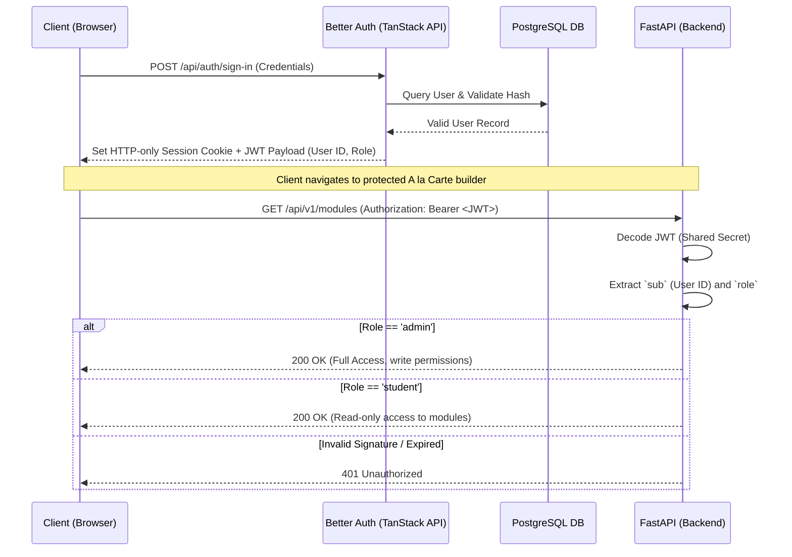
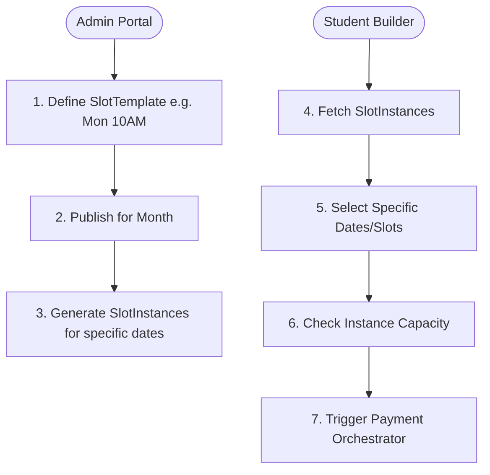
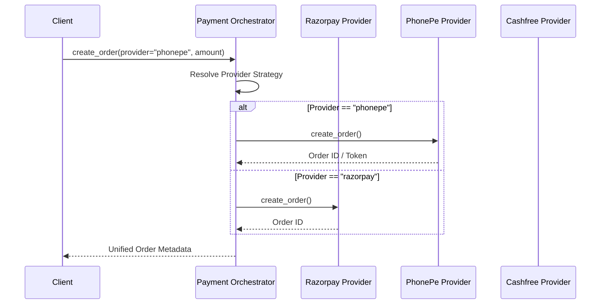
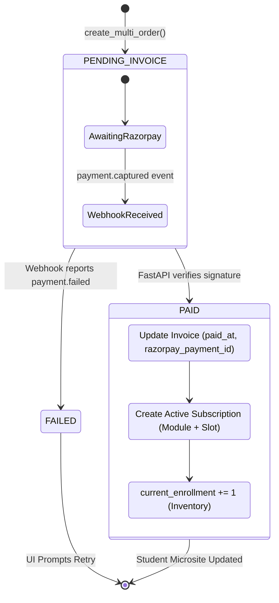
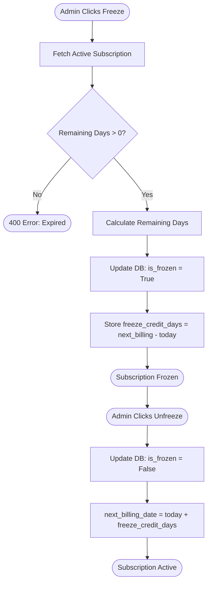
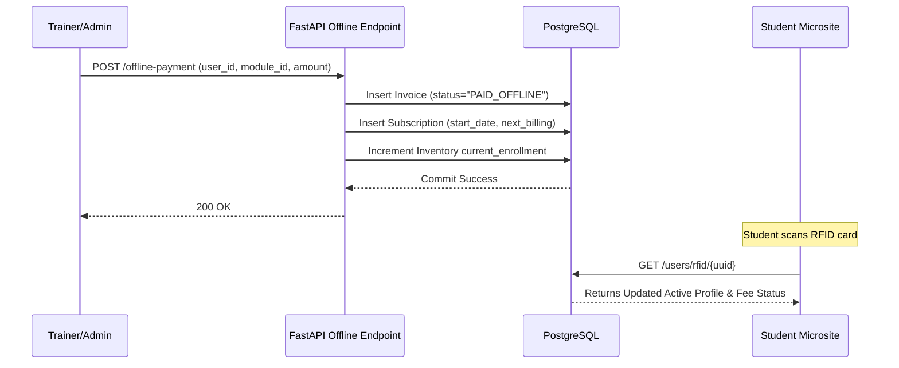

# XMFCLUB: System Architecture Diagrams

This document contains detailed Mermaid UML and Flowchart diagrams defining the pure technical architecture of the XMFCLUB platform. These diagrams are intended to align developers on design choices, specifically concerning RBAC, state machines, and concurrency handling.

## 1. Authentication & RBAC Flow (The Decoupled Model)

**Purpose:** Demonstrates how TanStack (Better Auth) and FastAPI (JWT) handle stateless authorization, ensuring the backend can rapidly verify permissions without a database bottleneck.



---

## 2. Admin Genesis & Platform Provisioning

**Purpose:** Outlines the sequence required to bootstrap the platform from an empty state to a fully operational A la Carte builder.

```mermaid
flowchart TD
    Start([System Genesis]) --> CreateSuperAdmin[1. Seed Super Admin]
    CreateSuperAdmin --> AdminLogin[2. Admin Logs In via Better Auth]
    
    AdminLogin --> ModuleCreation[3. POST /api/v1/modules]
    ModuleCreation --> DefinePricing[Set Price, Category, Duration]
    
    ModuleCreation --> InventoryCreation[4. POST /api/v1/inventory]
    InventoryCreation --> AssignTrainer[Assign Trainer UUID]
    InventoryCreation --> DefineSlot[Set Day, Start/End Time]
    InventoryCreation --> SetCapacity[Set Max Capacity (e.g., 15)]
    
    SetCapacity --> PlatformReady([Platform Ready for Students])
```

---

## 3. A la Carte Builder & Inventory Engine (Supply vs Demand)

**Purpose:** Explains how the system generates bookable slots from templates and handles flexible date selection.



---

## 4. Multi-Gateway Payment Orchestrator

**Purpose:** Shows the strategy pattern in action for handling multiple payment providers.



---

## 4. Payment Webhook & Subscription State Machine

**Purpose:** Details the asynchronous workflow when Razorpay successfully captures a payment, updating both the financial invoice and the student's active curriculum.



---

## 5. The Halal Freeze Policy Flow

**Purpose:** The business logic for pausing a subscription fairly without predatory billing.



---

## 6. Offline Payment Single-Source-Of-Truth

**Purpose:** How cash or direct UPI transfers are logged without breaking the digital ecosystem.


