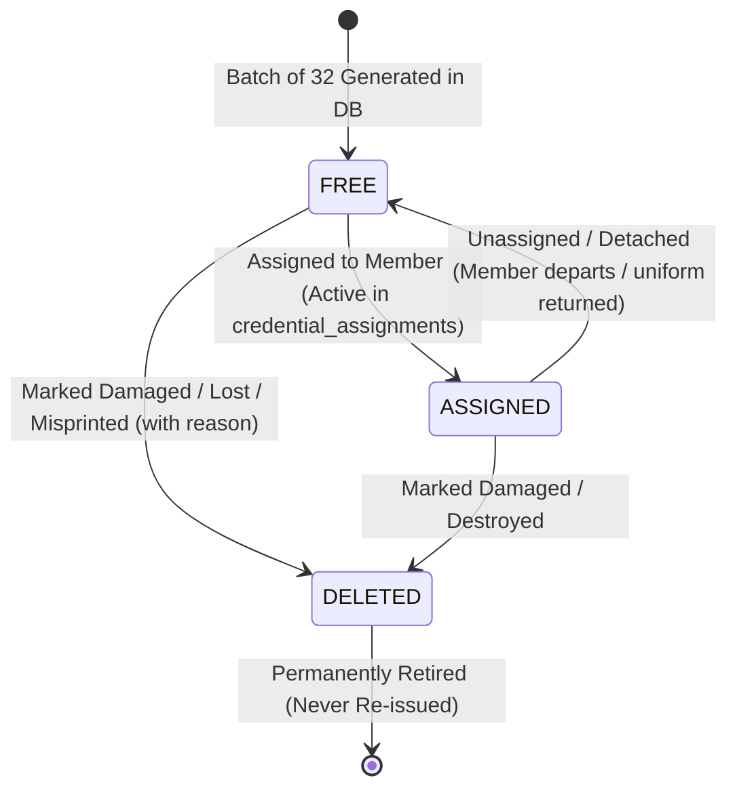

# Comprehensive Implementation Plan: Reusable Member QR + NFC Credential System (`qrc` & `tag`)

This document is the definitive technical specification and step-by-step engineering blueprint for implementing the **Reusable Hardware Credential System** for uniform QR badges (`qrc`) and NFC wristbands/cards (`tag`) across all members of `xmfclub`. It serves as the developer handbook for building the database schema, sequential Crockford Base32 token generator, printable layout engine, Web NFC tag provisioner, resolution routing endpoints, and app-wide assignment/reassignment workflows in `/xmform`, `/member/:memberId`, and `/admin`.

---

## 1. Executive Architecture & Core Mental Model

The system can be reduced to one architectural rule:
> **A member owns no physical QR or NFC directly; a member is assigned credentials, and physical credentials are reusable hardware assets.**

```text
                     MEMBER (public.members)
                   member_id: XMFYYZZ (PK)
                      All Club Roles
                       │          │
               ASSIGNMENT        ASSIGNMENT
              (Active 1:1)      (Active 1:1)
                       │          │
                       ▼          ▼
                 QR CREDENTIAL   NFC CREDENTIAL
                    000000           000000
                       │          │
                       ▼          ▼
                 Uniform Badge   NFC Wristband/Card
                       │          │
                       └────┬─────┘
                            │
                   RESOLUTION ROUTING
              /qrc/000000    /tag/000000
                            │
                            ▼
                     MEMBER PROFILE
                   /member/XMFYYZZ
```

### Architectural Principles:
1. **Decoupled Identity**:
   - Member ID (`XMFYYZZ`) is an application-level identity (e.g. `XMF2001`, `XMF2201`, `XMF2601`).
   - Physical tokens (`000000` to `ZZZZZZ`) identify the physical embroidery, sticker, or silicon chip.
   - If a member changes IDs, their physical uniform badges remain untouched.
2. **Universal Scope**:
   - Every member of `xmfclub` across all roles (`student`, `instructor`, `volunteer`, `admin`) can be assigned credentials.
   - `/xmform` is the universal member intake hub.
3. **Physical Asset Reuse**:
   - When a member leaves the dojo, credentials are set to **`free`** (unassigned) and placed back into the dojo inventory drawer.
   - When re-issued to a new member, **zero physical reprogramming or reprinting is required**. Only the database assignment pointer is updated.
4. **Natural Crockford Base32 Radix (Fixed 32 Items per Batch)**:
   - Each batch has **strictly 32 items** (one full cycle of Crockford Base32 `0` to `Z`):
     - **Batch 0**: `000000` to `00000Z`
     - **Batch 1**: `000010` to `00001Z`
     - **Batch 2**: `000020` to `00002Z`
     - **Batch $b$**: `encodeCrockford(b, 5) + [0-Z]`
   - Formats cleanly onto standard sticker sheets (4 columns $\times$ 8 rows = 32 badges per sheet).

---

## 2. Database Schema & Migration (`supabase/schema.sql`)

### 2.1 Primary Key Consolidation on `public.members`
To eliminate redundant UUIDs and confusing dualities, `public.members` consolidates on `member_id TEXT PRIMARY KEY` (strictly `XMFYYZZ`):

```sql
-- 1. Members Table Consolidation
CREATE TABLE IF NOT EXISTS public.members (
    member_id TEXT PRIMARY KEY, -- Strictly XMFYYZZ (e.g. XMF2001, XMF2601)
    name TEXT NOT NULL,
    dob DATE,
    age INTEGER,
    phone TEXT,
    email TEXT,
    role TEXT DEFAULT 'student' NOT NULL, -- 'student', 'instructor', 'volunteer', 'admin'
    belt TEXT DEFAULT 'White' NOT NULL,
    member_status TEXT DEFAULT 'Active' NOT NULL, -- 'Active', 'Inactive', 'Discontinued'
    fee_status TEXT DEFAULT 'Paid' NOT NULL, -- 'Paid', 'Pending', 'Overdue'
    pattern_hash TEXT NOT NULL DEFAULT '048526',
    address TEXT,
    branch TEXT DEFAULT 'XMF Main HQ',
    blood_group TEXT,
    date_of_joining DATE DEFAULT CURRENT_DATE,
    date_of_leaving DATE,
    achievements TEXT,
    instructor_remarks TEXT,
    instructor_remarks_color TEXT DEFAULT 'green',
    actual_fee NUMERIC(10, 2) DEFAULT 0,
    fee_detail TEXT,
    due_date DATE,
    pending_amount NUMERIC(10, 2) DEFAULT 0,
    photo_url TEXT,
    is_reviewed BOOLEAN DEFAULT false NOT NULL,
    is_deleted BOOLEAN DEFAULT false NOT NULL,
    created_at TIMESTAMPTZ DEFAULT timezone('utc'::text, now()) NOT NULL,
    updated_at TIMESTAMPTZ DEFAULT timezone('utc'::text, now()) NOT NULL
);

-- Child tables cascade on member_id:
ALTER TABLE public.attendance 
    DROP CONSTRAINT IF EXISTS attendance_member_id_fkey,
    ALTER COLUMN member_id TYPE TEXT,
    ADD CONSTRAINT attendance_member_id_fkey 
    FOREIGN KEY (member_id) REFERENCES public.members(member_id) 
    ON UPDATE CASCADE ON DELETE CASCADE;

ALTER TABLE public.event_registrations 
    DROP CONSTRAINT IF EXISTS event_registrations_member_id_fkey,
    ALTER COLUMN member_id TYPE TEXT,
    ADD CONSTRAINT event_registrations_member_id_fkey 
    FOREIGN KEY (member_id) REFERENCES public.members(member_id) 
    ON UPDATE CASCADE ON DELETE CASCADE;
```

### 2.2 Credential Tables & Sequences

```sql
-- 2. Sequences for Crockford Base32 Batch Indices (starts at 0)
CREATE SEQUENCE IF NOT EXISTS public.qrc_batch_seq START 0 MINVALUE 0;
CREATE SEQUENCE IF NOT EXISTS public.tag_batch_seq START 0 MINVALUE 0;

-- 3. Batches Table (Fixed 32 items per batch)
CREATE TABLE IF NOT EXISTS public.credential_batches (
    id UUID PRIMARY KEY DEFAULT gen_random_uuid(),
    batch_number INTEGER NOT NULL,
    type TEXT NOT NULL CHECK (type IN ('qrc', 'tag')),
    quantity INTEGER NOT NULL DEFAULT 32 CHECK (quantity = 32),
    start_token TEXT NOT NULL,
    end_token TEXT NOT NULL,
    configuration JSONB NOT NULL DEFAULT '{}'::jsonb,
    created_by TEXT REFERENCES public.members(member_id),
    created_at TIMESTAMPTZ DEFAULT timezone('utc'::text, now()) NOT NULL,
    CONSTRAINT unique_batch_per_type UNIQUE (type, batch_number)
);

-- 4. Reusable Physical Credentials Table
CREATE TABLE IF NOT EXISTS public.credentials (
    id UUID PRIMARY KEY DEFAULT gen_random_uuid(),
    type TEXT NOT NULL CHECK (type IN ('qrc', 'tag')),
    token TEXT NOT NULL, -- 6-digit Crockford Base32 (e.g. 000000, 000010)
    status TEXT NOT NULL DEFAULT 'free' CHECK (status IN ('free', 'assigned', 'deleted')),
    batch_id UUID REFERENCES public.credential_batches(id),
    physical_uid TEXT, -- Manufacturer chip UID (e.g. 04:A3:91:72:8C:11)
    rejection_reason TEXT, -- 'printing_error', 'damaged', 'misaligned', 'chip_failure', 'other'
    created_at TIMESTAMPTZ DEFAULT timezone('utc'::text, now()) NOT NULL,
    updated_at TIMESTAMPTZ DEFAULT timezone('utc'::text, now()) NOT NULL,
    CONSTRAINT unique_token_per_type UNIQUE (type, token)
);

-- 5. Credential Assignments Table (Audit & Active Linkage)
CREATE TABLE IF NOT EXISTS public.credential_assignments (
    id UUID PRIMARY KEY DEFAULT gen_random_uuid(),
    credential_id UUID NOT NULL REFERENCES public.credentials(id) ON DELETE CASCADE,
    member_id TEXT NOT NULL REFERENCES public.members(member_id) ON UPDATE CASCADE ON DELETE CASCADE,
    assigned_by TEXT REFERENCES public.members(member_id),
    assigned_at TIMESTAMPTZ DEFAULT timezone('utc'::text, now()) NOT NULL,
    unassigned_at TIMESTAMPTZ,
    created_at TIMESTAMPTZ DEFAULT timezone('utc'::text, now()) NOT NULL
);

-- 6. Indexes & RLS
CREATE UNIQUE INDEX IF NOT EXISTS one_active_assignment_per_credential
ON public.credential_assignments(credential_id)
WHERE unassigned_at IS NULL;

CREATE INDEX IF NOT EXISTS idx_credential_assignments_member_id 
ON public.credential_assignments(member_id);

CREATE INDEX IF NOT EXISTS idx_credentials_status 
ON public.credentials(status);

CREATE INDEX IF NOT EXISTS idx_credentials_token 
ON public.credentials(token);

-- RLS Policies
ALTER TABLE public.credential_batches ENABLE ROW LEVEL SECURITY;
ALTER TABLE public.credentials ENABLE ROW LEVEL SECURITY;
ALTER TABLE public.credential_assignments ENABLE ROW LEVEL SECURITY;

-- Public can read credentials & active assignments for resolution routing (/qrc/*, /tag/*)
CREATE POLICY "Public read credentials" ON public.credentials FOR SELECT USING (true);
CREATE POLICY "Public read credential_assignments" ON public.credential_assignments FOR SELECT USING (true);
CREATE POLICY "Public read credential_batches" ON public.credential_batches FOR SELECT USING (true);

-- Staff (Admins and Volunteers) have full mutation rights
CREATE POLICY "Staff insert batches" ON public.credential_batches FOR INSERT WITH CHECK (true);
CREATE POLICY "Staff insert credentials" ON public.credentials FOR INSERT WITH CHECK (true);
CREATE POLICY "Staff update credentials" ON public.credentials FOR UPDATE USING (true) WITH CHECK (true);
CREATE POLICY "Staff insert assignments" ON public.credential_assignments FOR INSERT WITH CHECK (true);
CREATE POLICY "Staff update assignments" ON public.credential_assignments FOR UPDATE USING (true) WITH CHECK (true);
```

---

## 3. Crockford Base32 Token & Batch Mathematics (`src/lib/credentialToken.ts`)

Reuses [`src/lib/crockford.ts`](file:///Users/alhamdulillah/codespace/xmfclub/src/lib/crockford.ts) directly without external dependencies.

```typescript
import { encodeCrockford, decodeCrockford, normalizeCrockford, CROCKFORD_ALPHABET } from './crockford';

export const BATCH_SIZE = 32;

export interface BatchTokensResult {
  batchNumber: number;
  prefix: string;
  tokens: string[];
  startToken: string;
  endToken: string;
}

/**
 * Calculates exactly 32 tokens for a given batch number (starting at 0).
 * Prefix is encodeCrockford(batchNumber, 5).
 * Suffix cycles through CROCKFORD_ALPHABET ('0' through 'Z').
 */
export function calculateBatchTokens(batchNumber: number): BatchTokensResult {
  if (batchNumber < 0 || !Number.isInteger(batchNumber)) {
    throw new Error('Batch number must be a non-negative integer.');
  }

  // 5 characters for the batch index (supports 32^5 = 33,554,432 batches)
  const prefix = encodeCrockford(batchNumber, 5);
  const tokens: string[] = [];

  for (let i = 0; i < 32; i++) {
    tokens.push(`${prefix}${CROCKFORD_ALPHABET[i]}`);
  }

  return {
    batchNumber,
    prefix,
    tokens,
    startToken: tokens[0],
    endToken: tokens[31],
  };
}

/**
 * Extracts batch number and item index from a 6-character token.
 */
export function parseCredentialToken(token: string): { valid: boolean; batchNumber?: number; itemIndex?: number; normalized?: string } {
  const { valid, normalized } = normalizeCrockford(token);
  if (!valid || normalized.length !== 6) {
    return { valid: false };
  }

  const batchPrefix = normalized.slice(0, 5);
  const itemChar = normalized.slice(5, 6);

  const batchNumber = decodeCrockford(batchPrefix);
  const itemIndex = decodeCrockford(itemChar);

  if (batchNumber < 0 || itemIndex < 0) {
    return { valid: false };
  }

  return { valid: true, batchNumber, itemIndex, normalized };
}

/**
 * Generates the canonical resolution URL for QR codes and NFC tags.
 */
export function buildCredentialUrl(type: 'qrc' | 'tag', token: string, baseUrl = 'https://xmfclub.com'): string {
  const { valid, normalized } = normalizeCrockford(token);
  if (!valid) throw new Error(`Invalid credential token: ${token}`);
  return `${baseUrl}/${type}/${normalized}`;
}
```

---

## 4. Physical Asset Lifecycle & State Machine



### State Definitions:
- **`free`**: In dojo inventory. Not linked to any active member. Ready to be issued.
- **`assigned`**: Sewn into an active member's uniform or programmed into their card.
- **`deleted`**: Physically damaged, misprinted, or lost. Retained in database for audit history; never re-issued.

### Reassignment (Zero Reprogramming):
When Member `XMF2601` leaves:
1. Staff clicks **Unassign**.
2. `credential_assignments.unassigned_at = now()`.
3. `credentials.status = 'free'`.
4. Uniform is handed to Member `XMF2602`.
5. Staff clicks **Assign to XMF2602**.
6. A new `credential_assignments` record is created.
7. **The physical QR and NFC tag stay identical!** The URL `https://xmfclub.com/qrc/000000` now automatically resolves to `XMF2602`.

---

## 5. Role & Permission Model

| Action | `admin` | `volunteer` | `instructor` | `student` |
| :--- | :---: | :---: | :---: | :---: |
| **Generate 32-Badge Batches** | Yes | Yes (Intake desk) | No | No |
| **Download PDF / SVG ZIP** | Yes | Yes | No | No |
| **Assign Credential to Member** | Yes | Yes | No | No |
| **Reassign Credential** | Yes | Yes | No | No |
| **Unassign Credential (Return to Free)** | Yes | Yes | No | No |
| **Mark Credential as Deleted** | Yes | Yes | No | No |
| **View Credential Inventory** | Yes | Yes | Read-Only | No |
| **View Own Assigned Credentials** | Yes | Yes | Yes | Yes |
| **Mark Attendance** | Yes | No | Yes | No |
| **Review / Verify Member** | Yes | No | No | No |

Staff role check:
```typescript
const isStaff = user?.role === 'admin' || user?.role === 'volunteer';
```

---

## 6. Feature A: Bulk QR Code Generator (`src/lib/qrLayout.ts`)

### 6.1 Layout Engine Specifications (Standard 32 Badges per Sheet)
- **Default Grid**: 4 columns $\times$ 8 rows = 32 stickers.
- **Standard A4 Dimensions**: $210 \times 297$ mm.
- **Cell Dimensions**:
  - Available width: $210 - 2 \times 10\text{mm} = 190\text{mm} \implies \approx 42\text{mm}$ cell width (QR size: $32\text{mm}$, padding: $5\text{mm}$, gap: $5\text{mm}$).
  - Available height: $297 - 2 \times 12\text{mm} = 273\text{mm} \implies \approx 32\text{mm}$ cell height.
- **Customizable**: Columns (e.g. 3 or 4), QR physical size, margins, gaps, token text (ON/OFF), sequence marker (ON/OFF).

### 6.2 Vector PDF & SVG ZIP Generation
1. **Multi-page Vector PDF (`jspdf`)**:
   - Encodes URL `https://xmfclub.com/qrc/000000` with Level M Error Correction.
   - Preserves vector paths for crisp print-shop production at 300+ DPI.
   - Cell content:
     ```text
     ┌──────────────┐
     │  [QR CODE]   │
     │    000000    │  <-- 6-char Crockford token
     │     #001     │  <-- Sequence manufacturing marker
     └──────────────┘
     ```
2. **SVG ZIP Archive (`jszip`)**:
   - Generates 32 crisp SVG files: `000000.svg` through `00000Z.svg`.
   - Downloaded as `qrc-batch-00000.zip`.

---

## 7. Feature B: Web NFC Tag Provisioning (`NfcProvisionerModal.tsx`)

In-browser programming using the Web NFC API (`window.NDEFReader`):

```typescript
async function provisionNfcTag(token: string, memberId: string) {
  const ndef = new (window as any).NDEFReader();
  await ndef.scan();

  // 1. Write canonical NDEF URL record
  const targetUrl = buildCredentialUrl('tag', token);
  await ndef.write({
    records: [{ recordType: 'url', data: targetUrl }]
  });

  // 2. Read back verification
  const readBackPromise = new Promise<{ verified: boolean; uid?: string }>((resolve, reject) => {
    const timeout = setTimeout(() => reject(new Error('Verification read timed out')), 5000);
    ndef.onreading = (event: any) => {
      clearTimeout(timeout);
      const readUrl = new TextDecoder().decode(event.message.records[0].data);
      if (readUrl.trim() === targetUrl.trim()) {
        resolve({ verified: true, uid: event.serialNumber });
      } else {
        reject(new Error(`URL mismatch: expected ${targetUrl}, found ${readUrl}`));
      }
    };
  });

  const verification = await readBackPromise;
  return verification;
}
```

---

## 8. Public Resolution Endpoints & In-App Scanner

### 8.1 Route: `/qrc/$token` (`src/routes/qrc/$token.tsx`)
```typescript
export const Route = createFileRoute('/qrc/$token')({
  loader: async ({ params }) => {
    const { valid, normalized } = normalizeCrockford(params.token);
    if (!valid || normalized.length !== 6) {
      return { status: 'invalid' };
    }

    // 1. Query active assignment
    const { data: cred } = await supabase
      .from('credentials')
      .select('status, credential_assignments(member_id, unassigned_at)')
      .eq('type', 'qrc')
      .eq('token', normalized)
      .maybeSingle();

    if (!cred) return { status: 'not_found', token: normalized };

    const activeAssignment = cred.credential_assignments?.find((a: any) => !a.unassigned_at);
    if (activeAssignment?.member_id) {
      // 2. Perform server/client redirect to member profile
      throw redirect({ to: '/member/$memberId', params: { memberId: activeAssignment.member_id } });
    }

    return { status: cred.status, token: normalized };
  },
  component: CredentialResolutionView,
});
```

### 8.2 Route: `/tag/$token` (`src/routes/tag/$token.tsx`)
Identical loader for `type = 'tag'`.

### 8.3 Scanner Pattern Matcher Upgrade (`src/routes/admin/index.tsx`)
Update QR Scanner `onScan` callback:
```typescript
onScan={(result) => {
  if (result.length > 0) {
    const raw = result[0].rawValue.trim();

    // 1. Direct QRC/TAG URL: https://.../qrc/000000 or /tag/000000
    const urlMatch = raw.match(/\/(qrc|tag)\/([0-9A-HJ-KM-NP-TV-Z]{6})/i);
    if (urlMatch) {
      const type = urlMatch[1].toLowerCase();
      const token = urlMatch[2].toUpperCase();
      navigate({ to: `/${type}/${token}` });
      return;
    }

    // 2. Raw 6-character Crockford Token (000000)
    if (/^[0-9A-HJ-KM-NP-TV-Z]{6}$/i.test(raw)) {
      navigate({ to: `/qrc/${raw.toUpperCase()}` });
      return;
    }

    // 3. Direct Member ID: XMFYYZZ
    const memberMatch = raw.match(/XMF\d{2}[0-9A-HJ-KM-NP-TV-Z]{2,3}/i);
    if (memberMatch) {
      navigate({ to: `/member/${memberMatch[0].toUpperCase()}` });
      return;
    }

    setAppAlert({ message: `Unrecognized scan format: ${raw}` });
  }
}}
```

---

## 9. UI Components & Workflows

### 9.1 `src/components/CredentialAssignmentModal.tsx`
A unified glassmorphism modal accessible across `/xmform`, `/member/:memberId`, and `/admin`:
- **Assign Mode**:
  - Filter and select from existing `free` credentials, OR scan camera/NFC.
  - Links selected credential to member `XMFYYZZ`.
- **Reassign Mode**:
  - Transfer an active credential from Member A to Member B with 1 click.
  - Retains physical hardware unchanged.
- **Unassign / Detach Mode**:
  - Clears member assignment, returning credential to `free` inventory.
- **Mark Deleted Mode**:
  - Sets status to `deleted` with reason selection (`damaged`, `lost`, `printing_error`).

### 9.2 `/xmform` Integration
- **Intake Tab**:
  - Optional field during enrollment: *"Assign Uniform Badge / NFC Tag"*. Staff can select available `free` badges right from the intake desk.
- **Directory Tab**:
  - Each member row renders active badge tags: `[QRC: 000000]` and `[TAG: 000000]`.
  - Clicking any tag or the `+ Assign` button opens `CredentialAssignmentModal`.

### 9.3 `/member/$memberId` Integration
- Sidebar renders a dedicated **Physical Credentials** card:
  - Active QRC badge (with click-to-preview printable graphic).
  - Active NFC Tag badge.
  - If staff (`admin` or `volunteer`), displays **"Manage Credentials"** button.

### 9.4 `/admin` Credentials Hub
- Sub-tabs:
  1. **Inventory**: Real-time stats (Total, Free, Assigned, Deleted) with searchable table.
  2. **Generate QRC Batch**:
     - Displays: *"Next Batch: Batch #B (Tokens: [prefix]0 to [prefix]Z)"*.
     - One-click **"Generate Batch of 32"**.
     - Live 4 $\times$ 8 printable sheet preview.
     - One-click **"Download PDF"** and **"Download SVG ZIP"**.
  3. **NFC Provisioning**: Web NFC interactive programming screen.

---

## 10. Step-by-Step Developer Implementation Checklist

1. [ ] **Phase 1: Database Migration**:
   - Update `public.members` to `member_id TEXT PRIMARY KEY`.
   - Update `attendance` and `event_registrations` foreign keys.
   - Add `credential_batches`, `credentials`, `credential_assignments`, and sequences.
   - Run seed script and verify in Supabase.
2. [ ] **Phase 2: Core Utilities & Unit Tests**:
   - Create `src/lib/credentialToken.ts`.
   - Create `src/lib/credentialToken.test.ts` (test 32-item batch generation, parsing, normalization).
   - Run `npm run test`.
3. [ ] **Phase 3: Resolution Routes**:
   - Create `src/routes/qrc/$token.tsx`.
   - Create `src/routes/tag/$token.tsx`.
   - Implement active redirect to `/member/:memberId` and unassigned fallback view.
4. [ ] **Phase 4: Shared Modal Component**:
   - Build `src/components/CredentialAssignmentModal.tsx`.
   - Implement Assign, Reassign, Unassign, and Delete mutations.
5. [ ] **Phase 5: `/xmform` & Member Profile Integration**:
   - Update `/xmform` intake form & directory rows.
   - Update `/member/$memberId` credentials sidebar card.
   - Gated to `admin` and `volunteer` roles.
6. [ ] **Phase 6: Admin Batch Generator & Print Engine**:
   - Build `src/lib/qrLayout.ts` (4 $\times$ 8 grid on A4).
   - Add PDF download via `jspdf` and SVG ZIP via `jszip`.
   - Wire into `/admin` credentials tab.
7. [ ] **Phase 7: Web NFC Provisioner**:
   - Build `NfcProvisionerModal.tsx` with Web NFC write + read-back verification.
8. [ ] **Phase 8: Verification**:
   - Run `npm run test && npx tsc -b && npm run build`.
   - Verify zero errors across the entire codebase.
